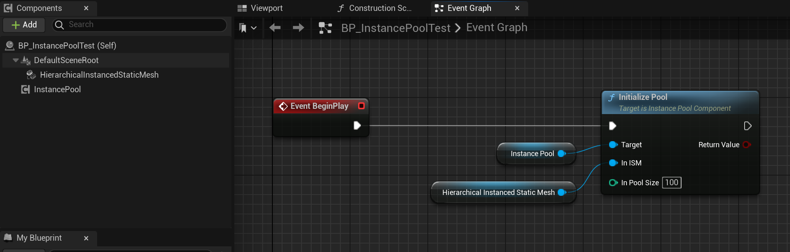
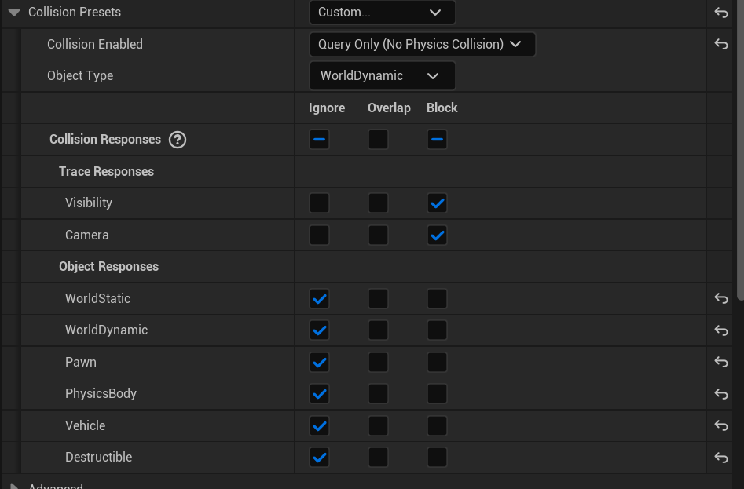
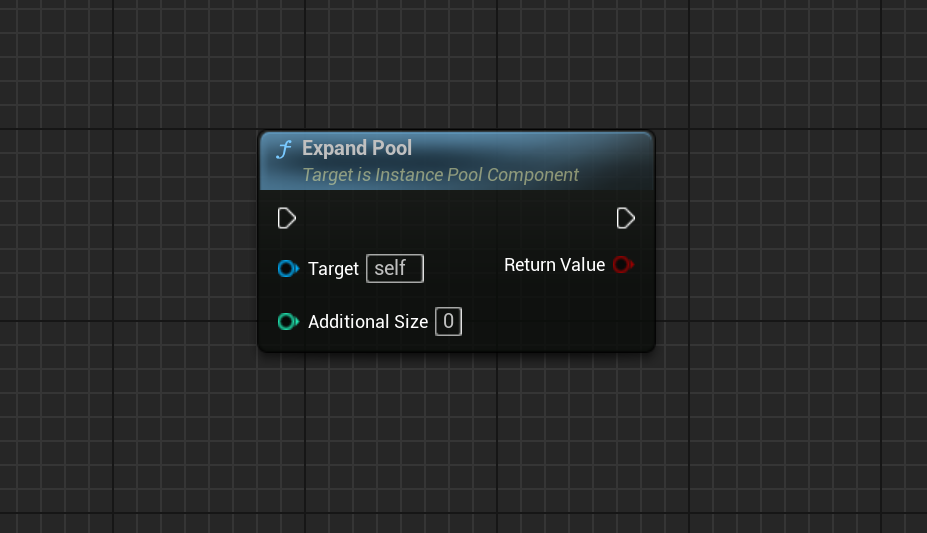
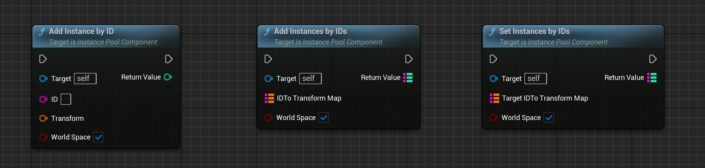
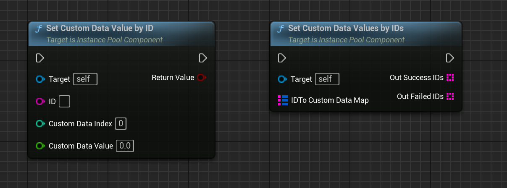
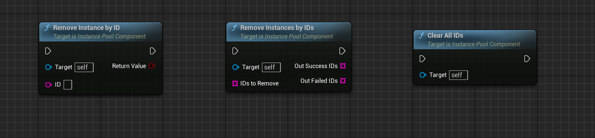
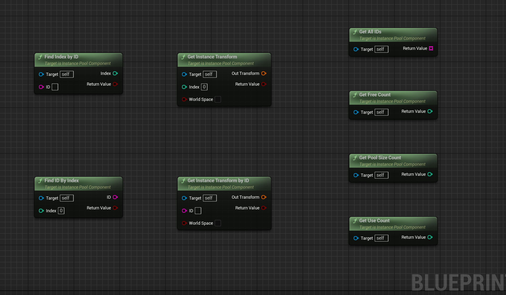
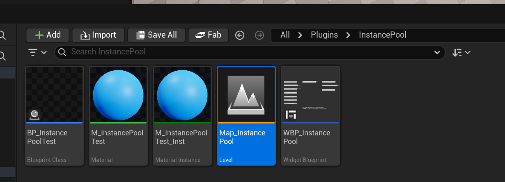

# InstancePool
This is a UE plugin used for handling InstanceMeshPool.

### Why is an object pool needed?

When using the ISM component directly in UE, developers face several key challenges:
\- **High overhead when frequently adding/removing instances**: Each call to `AddInstance`/`RemoveInstance` triggers a render state update.
\- **Lack of an effective ID management mechanism**: ISM accesses instances only through indices, making it difficult to track entities in business logic.
\- **Inconvenient CustomData management**: There is no unified interface for managing CustomData.
\- **Opaque memory management**: It is difficult to effectively control the number of instances, which may lead to memory overflow.

There are many actor and object pools in the marketplace, but there is not yet an object pool for instance meshes.

### Instance Lifecycle Management

| Function | Description | Advantages |
| -------- | ----------- | ---------- |
| Pool Initialization | Pre-create a fixed number of instances | Avoid runtime creation overhead |
| Pool Expansion | Dynamically increase pool capacity as needed | Balance memory usage and performance |
| Instance Reuse | Manage instance lifecycle through an ID system | Prevent frequent creation/destruction |
| State Synchronization | Implement full synchronization with `SetInstancesByIDs` | Simplify dynamic object management |

###  Quick Start

#### Step 1: Setting Up the Scene

1. Create a static mesh in the scene.
2. Add an `InstancedStaticMeshComponent` to the Actor.
3. Assign the static mesh to the ISM component.

4. For UE5.6 and above, it is recommended to modify the collision settings.

 

5. When the object pool is insufficient, it will automatically expand, or it can be expanded manually.

 

#### Step 2: Add Instances and Set CustomDataValue

**AddInstanceByID**: Add or update a single instance by ID

**AddInstancesByIDs**: Batch add or update instances by ID

**SetInstancesByIDs**: Performs a full synchronization of instances by ID. There is one instance for each ID, making it particularly suitable for full data synchronization.

#### Step 3: Remove the Instance

#### Step 4: Query the API

**FindIndexByID**: Find the instance index based on the ID
**FindIDByIndex**: Find the ID based on the instance index
**GetInstanceTransformByID**: Get the instance Transform based on the ID
**GetAllIDs**: Retrieve all currently active instance IDs
**GetPoolSizeCount**: Get the total capacity of the object pool
**GetUseCount**: Get the number of instances currently in use
**GetFreeCount**: Get the number of instances currently free

#### Step 5: Example Level

 
